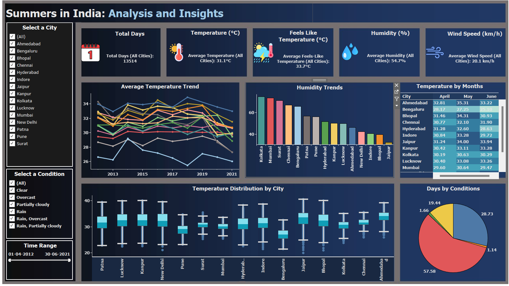

# 🌞 Summers in India: Analysis and Insights - Dashboard

This interactive **Tableau** dashboard provides a detailed analysis of summer weather patterns across key Indian cities from **April 1, 2012 to June 30, 2021**. The data is sourced and queried using **PostgreSQL**, offering real-time insights into temperature, humidity, weather conditions, and more.
 
## 📊 Dashboard Overview

### ✅ Key Metrics Summary
- **Total Days Analyzed**: 13,514 days
- **Average Temperature**: 31.1°C
- **Feels Like Temperature**: 33.7°C
- **Average Humidity**: 54.7%
- **Average Wind Speed**: 20.1 km/h

## 📈 Visual Components

### 1. **Average Temperature Trend**
- Year-wise temperature trends (2012–2021) by city using line graphs.

### 2. **Humidity Trends**
- Bar chart comparing average humidity levels across cities.
- Highest: **Kolkata**, **Mumbai**, **Surat**

### 3. **Temperature Distribution**
- Box plots show temperature variability across cities.

### 4. **Monthly Temperature Table**
- April, May, June average temperatures per city.

### 5. **Weather Conditions (Pie Chart)**
- Distribution of summer days by condition:
  - Clear: **57.58%**
  - Partially Cloudy: **28.73%**
  - Overcast: **11.14%**
  - Rain & Mixed Conditions: Remaining %

## 🔍 Filter Options

- **City Selector**: 15 major cities including Delhi, Mumbai, Bengaluru, Chennai, etc.
- **Condition Filter**: Clear, Overcast, Partially Cloudy, Rain, and combinations
- **Time Range Slider**: Adjustable between April 2012 – June 2021
  
## 🧰 Tools & Technologies

- **Tableau**: For interactive visual analytics
- **PostgreSQL**: Backend data storage and SQL querying

## 📌 Use Cases

- **Climate Research**
- **Urban Planning**
- **Environmental Studies**
- **Data Visualization Projects**

##  📁 Repository Structure

├── Dataset/
│   └── Indian Summers - Over the years.csv
│
├── Images/
│   ├── Dashboard/
│   │   ├── main_dashboard.png
│   │   ├── filter_usage.png
│   │   └── filter_use_ahmedabad.png
│   └── Queries/
│       ├── KPIs.png
│       └── charts.png
│
├── PostgreSQL/
│   ├── Main_Queries.sql
│   └── Summer_queries_1.sql
│
├── Workbook/
│   └── India_Summers.twb

## 🚀 Getting Started

To explore the dashboard:
1. Open `workbook/India_Summers.twb` in Tableau.
2. Connect it to your PostgreSQL DB or explore with static views.
3. Use filters and interact with visualizations.

## 📷 Preview

---

