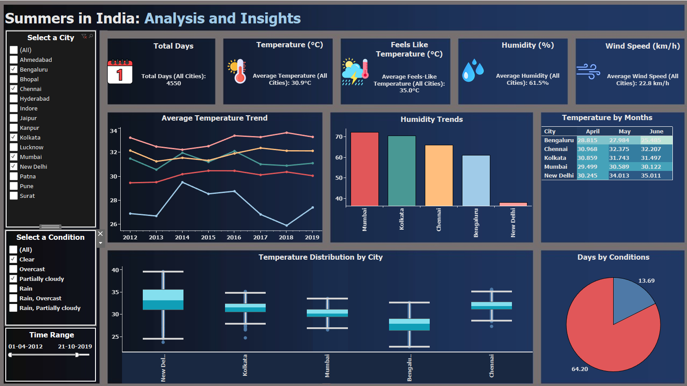
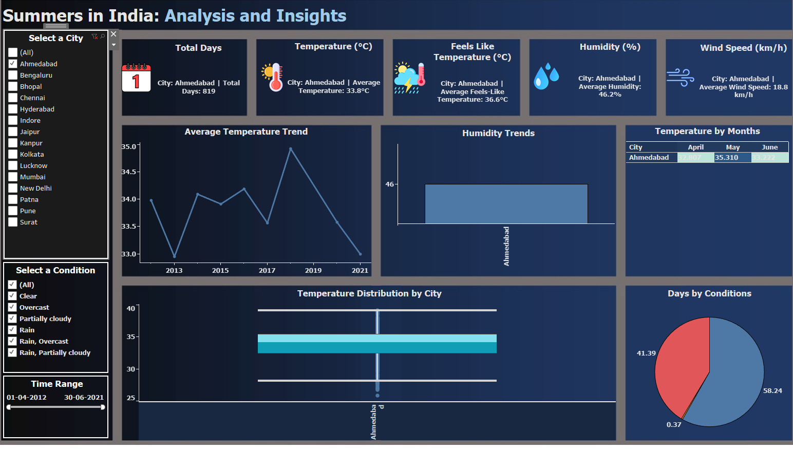
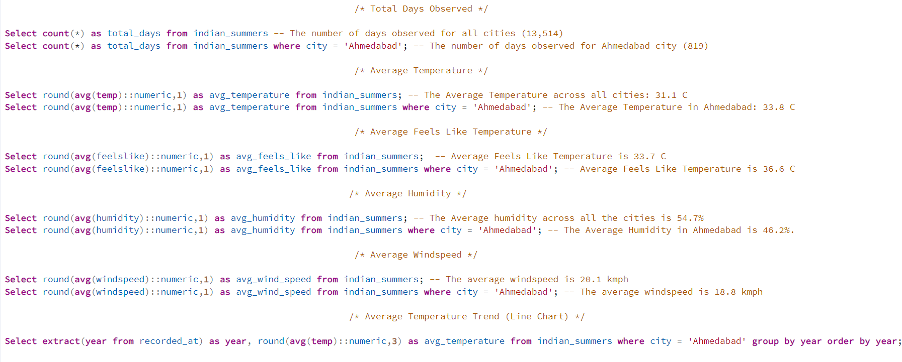
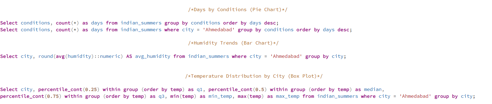

# 🌞 Summers in India: Analysis and Insights - Tableau Dashboard

This repository contains a Tableau dashboard project that provides detailed insights into summer weather conditions across major Indian cities from **April 1, 2012 to June 30, 2021**. The project uses **PostgreSQL** for data handling and **Tableau** for data visualization.

---

## 📁 Repository Structure

```
├── Dataset/
│   └── Indian Summers - Over the years.csv
│
├── Images/
│   ├── Dashboard/
│   │   ├── main_dashboard.png
│   │   ├── filter_usage.png
│   │   └── filter_use_ahmedabad.png
│   └── Queries/
│       ├── KPIs.png
│       └── charts.png
│
├── PostgreSQL/
│   ├── Main_Queries.sql
│   └── Summer_queries_1.sql
│
├── Workbook/
│   └── India_Summers.twb
```

---

## 📊 Dashboard Highlights


### ✅ Key Metrics
- **Total Days Analyzed**: 13,514
- **Average Temperature**: 31.1°C
- **Feels Like Temperature**: 33.7°C
- **Humidity**: 54.7%
- **Wind Speed**: 20.1 km/h

### 📈 Visualizations Include:
- **Yearly Average Temperature Trends** (2012–2021)
- **City-wise Humidity Comparisons**
- **Temperature Distribution (Box Plots)**
- **Monthly Temperature Averages**
- **Weather Condition Breakdown (Pie Chart)**

---

## 🔍 Filter Features

- **City Selector** (15 cities)
- **Condition Filter** (Clear, Overcast, Rain, etc.)
- **Date Range Slider** (April 2012 to June 2021)

Visual examples:
- 
- 

---

## 🛠️ Tools & Technologies

| Tool         | Purpose                         |
|--------------|----------------------------------|
| **Tableau**  | Visualization and Dashboarding   |
| **PostgreSQL** | Data querying and filtering     |
| **CSV Dataset** | Source data (cleaned and processed) |

---

## 🧪 SQL Query Snapshots

- 
- 

Explore actual SQL logic in the [`PostgreSQL/`](./PostgreSQL) folder:
- `Main_Queries.sql` – All major query definitions
- `Summer_queries_1.sql` – Supporting queries for visuals

---

## 📂 Tableau Workbook

Located in [`Workbook/`](./Workbook):
- `India_Summers.twb` – Tableau workbook (open with Tableau Desktop)

---

## 📌 Use Cases

- Analyze Indian summer climate trends over a decade
- Understand regional variations in heat, humidity, and weather
- Learn Tableau and SQL through a real-world case study

---

## 📥 Getting Started

1. Clone this repo.
2. Load `Indian Summers - Over the years.csv` into PostgreSQL.
3. Run queries from `PostgreSQL/` to build views or tables.
4. Open `India_Summers.twb` in Tableau and connect to your PostgreSQL DB.

---

